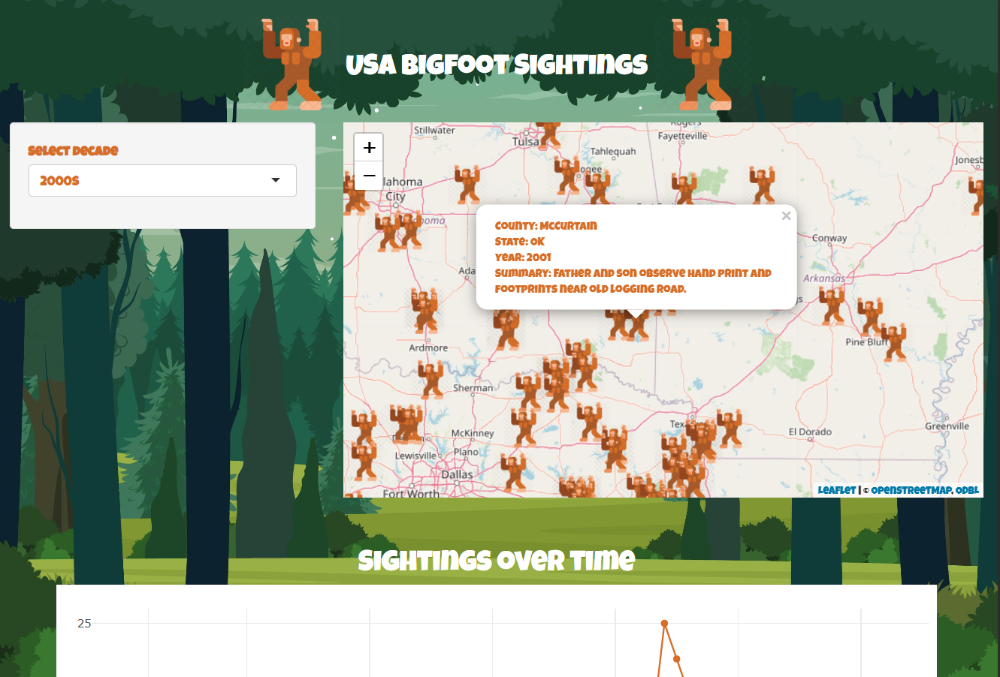
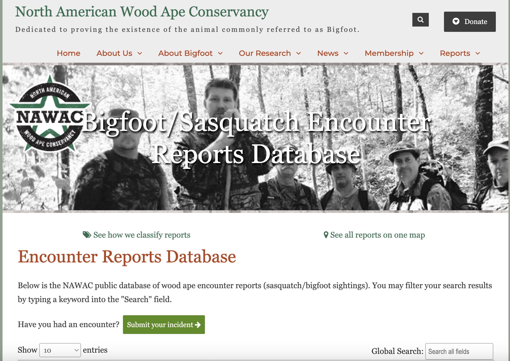
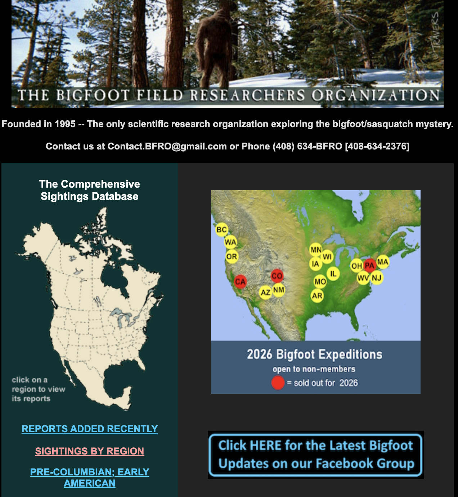

## Hello :)

Some things about me:

- My name is Melissa
- I am from New Zealand (not Australia)
- I like statistics
- I have a personal site here: statisticsmelissa.netlify.app
- Code for this presentation can be found here: https://github.com/melbather/bigfoot-grid-sim

## R-Ladies Vancouver!

::: {.columns .align-items-center}

::: {.column width="50%"}
{width=400}
:::

::: {.column width="50%" .absolute top=250 right=30}
https://www.meetup.com/r-ladies-vancouver/ 
:::

:::

## The idea

{fig-align="center"}


## Assumptions

:::: {.columns}

::: {.column width="70%"}

- Sasquatch = bigfoot
- Definition (according to Wikipedia): *a large, hairy, mythical humanoid creature said to inhabit forests in North America, particularly in the Pacific Northwest*
- Bigfoot is real
- There is more than one bigfoot (bigfeet?)

:::

::: {.column width="30%"}

{width=300}

:::

::::

# Definitions

## Spatial point process


:::: {.columns}

::: {.column width="50%"}

*A mathematical model that describes the distribution of events that occur in space.*

For example:

- Tree locations in a forest
- Road accident locations
- Locations of crime
- Animal locations
- Bigfoot sightings

:::

::: {.column width="50%"}

```{r}
#| echo: false
#| fig-width: 8
#| fig-height: 8
#| out-width: 100%
library(sf)
library(ggplot2)
library(spatstat.geom)
library(spatstat.random)

set.seed(42)
study_region <- st_as_sf(
  st_sfc(st_polygon(list(rbind(
    c(0, 0), c(10, 0), c(10, 10), c(0, 10), c(0, 0)
  ))))
)

window <- owin(xrange = c(0, 10), yrange = c(0, 10))
points_ppp <- rpoispp(lambda = 1.5, win = window)

points_sf <- st_as_sf(
  data.frame(
    x = points_ppp$x,
    y = points_ppp$y
  ),
  coords = c("x", "y")
)

ggplot() +
  geom_sf(data = study_region, fill = "white", color = "black", linewidth = 1) +
  geom_sf(data = points_sf, size = 3, alpha = 0.8, colour = "darkgreen") +
  coord_sf(expand = FALSE) +
  theme_void()
```

:::

::::


## Poisson point processes {.smaller}

### Homogeneous

:::: {.columns}

::: {.column width="80%"}

Points/events have a uniform probability of occurring anywhere in space.

Intensity: $\lambda(s) = \lambda$, where $s$ is a location in space.

:::

::: {.column width="20%"}

```{r}
#| fig-width: 3
#| fig-height: 3
#| out-width: 100%
#| fig-align: center
library(ggplot2)
library(grid)
library(gridExtra)
set.seed(123)
x1 <- rep(1:100)
y1 <- runif(100, 0, 1)
inhom <- rpoint(100, f = function(x, y) {y = exp(5*x)}, fmax = 100)
x2 <- inhom$x*100
y2 <- inhom$y
homogeneous <- data.frame(x1, y1)
inhomogeneous <- data.frame(x2, y2)
ggplot(homogeneous, aes(x1, y1)) +
  theme(panel.background = element_rect(fill = "#5ab06e"),
        panel.grid.major = element_blank(), 
        panel.grid.minor = element_blank(),
        axis.text.x=element_blank(),
      axis.ticks.x=element_blank(),
      axis.text.y=element_blank(),
      axis.ticks.y=element_blank(),
      plot.margin = margin(0, 0, 0, 0)) +
  xlab("") +
  ylab("") +
  geom_point()
```

:::

::::

:::: {.columns}

::: {.column width="80%"}

### Inhomogeneous

Points/events vary in intensity across space, depending on variables. For bigfoot sightings, this could be based on proximity to food sources, tree cover, or the number of bigfoot believers who live nearby. 

Intensity: $\lambda(s) = \exp(\beta_0 + \beta_1x_1(s) + ... + \beta_px_p(s))$, where $x_i(s)$ is a predictor and $\beta_i$ are the estimated effects.

:::

::: {.column width="20%"}

```{r}
#| fig-width: 3
#| fig-height: 3
#| out-width: 100%
#| fig-align: center
g <- rasterGrob(blues9, width=unit(1,"npc"), height = unit(1,"npc"), 
interpolate = TRUE) 
g2 <- rasterGrob(matrix(c("#8dd99f", "#66b077","#5ab06e","#1a3d22"), nrow = 1), 
                width=unit(1,"npc"), height = unit(1,"npc"), 
                interpolate = TRUE)
ggplot(inhomogeneous, aes(x2, y2)) +
  annotation_custom(g2, xmin=-Inf, xmax=Inf, ymin=-Inf, ymax=Inf) +
  theme(axis.text.x=element_blank(),
      axis.ticks.x=element_blank(),
      axis.text.y=element_blank(),
      axis.ticks.y=element_blank(),
      plot.margin = margin(0, 0, 0, 0)) +
  xlab("") +
  ylab("") +
  geom_point()
```

:::

::::

# Data Sources

## Option 1: {.smaller}
#### North American Wood Ape Conservancy's Encounter Reports Database 

:::: {.columns}

::: {.column width="50%"}

{width=500}

Found at: https://reports.woodape.org/data/

:::

::: {.column width="50%"}

**Pros:**

- Easy to scrape (I have a simple script here: https://github.com/melbather/bigfoot-app/blob/main/bigfoot-app/global.R)
- Tidy

**Cons:**

- Heavily biased towards Texas (or maybe there are just more bigfeet in Texas?)
- Small dataset compared to other options (currently at 506 entries)

:::

::::

## Option 2: {.smaller}
#### The Bigfoot Field Researchers Organization (BFRO)

:::: {.columns}

::: {.column width="40%"}

{width=500}

Found at: https://www.bfro.net/

:::

::: {.column width="60%"}

**Pros:**

- Other people have already scraped the dataset
  - https://github.com/timothyrenner/bfro_sightings_data
  - https://www.kaggle.com/datasets/mexwell/bigfoot-sightings
- Lots of covariate information available in the Kaggle dataset
- Larger number of sightings (4309 in the Kaggle dataset above)

**Cons:**

- Scary-looking website
- Dataset upated two years ago

:::

::::

## The BFRO Dataset

The Kaggle dataset from Kaggle user Mexwell includes a geocoded file that contains the following columns:

```{r}
#| echo: true
bfro_data <- read.csv("data/bfro_reports_geocoded.csv")
names(bfro_data)
```

## The BFRO Dataset

There is some missing data, but there is still a lot to work with

```{r}
#| echo: true
summary(bfro_data)
```

## The BFRO Dataset

Let's plot the data

```{r}
#| echo: false
library(leaflet)

leaflet(bfro_data) |>
      addTiles() |>
      addMarkers(lng = ~longitude, 
                 lat = ~latitude, 
                 popup = ~paste("County:", county, 
                                "<br>State:", state,
                                "<br>Date:", date,
                                "<br>Summary:", observed),
                 icon = makeIcon(
                   iconUrl = "https://cdn.iconscout.com/icon/premium/png-256-thumb/bigfoot-icon-svg-png-download-2227694.png",
                   iconWidth = 35, iconHeight = 35
                 ))
```

## The BFRO Dataset

Let's plot the data (in a more practical way)

```{r}
#| echo: false
leaflet(bfro_data) |>
      addTiles() |>
      addCircleMarkers(lng = ~longitude, 
                 lat = ~latitude, 
                 popup = ~paste("County:", county, 
                                "<br>State:", state,
                                "<br>Date:", date,
                                "<br>Summary:", observed),
                 fillOpacity = 0.7,
                 stroke = FALSE,
                 radius = 4)
```


# Analysis!

## Cleaning data

Remove the nonsensical ocean bigfeet and only include observations where latitude and longitude are known

```{r}
#| echo: true
library(dplyr)

bfro_data_clean <- bfro_data |> 
  filter(
    !(county == "Cowlitz County" & date == "2006-07-05"),
    !(county == "Flathead County" & date == "2012-09-16"),
    !(county == "Idaho County" & date == "2013-12-04"),
    !is.na(latitude),
    !is.na(longitude)
    ) |> 
  mutate(
    rain = grepl("rain", precip_type),
    snow = grepl("snow", precip_type)
  )
```

## `spatstat` package

https://spatstat.org/

https://cran.r-project.org/web/packages/spatstat/index.html

```{r}
#| output: false
#| echo: true
# install.packages("spatstat")
library(spatstat)
```

## Decide on our variables of interest

Which variables are likely to influence bigfoot sightings?

My hypothesis: temperature, precipitation (rain and snow), and visibility. 

## Problem

Covariate information needs to be known across the study area, not just at each sighting location. We are going to cheat for the purpose of this demonstration and simulate information when it isn't known.

Full code here: https://github.com/melbather/bigfoot-grid-sim

## Create a study window

This is telling R what our study area is. We are using the full geographic range of the sightings in the dataset, but we could also subset the data and define a smaller study area, like the PNW. 

```{r}
#| echo: true
W <- owin(
    xrange = range(bfro_data_clean$longitude),
    yrange = range(bfro_data_clean$latitude)
  )
```

## Create a point pattern

From the `spatstat` vignette: the `ppp` function *creates an object of class "ppp" representing a point pattern dataset in the two-dimensional plane*.

```{r}
#| echo: true
bigfoot_pp <- ppp(
  x = bfro_data_clean$longitude,
  y = bfro_data_clean$latitude,
  window = W
)
```

Here, each sighting becomes a point in space.

# ✨Simulation magic✨
*Unfortunately out of scope for this presentation, but you can see what I did in the GitHub repo*

## Inhomogeneous Poisson Point Model

```{r}
#| echo: false
library(googledrive)
drive_deauth()

dest <- "data/bigfoot-model-results.RData"
dir.create("data", showWarnings = FALSE)

if (!file.exists(dest) || file.info(dest)$size < 1e6) {
  drive_download(
    file = as_id("1el3JR-bzZA3mvjyYJJ6v7_Ex9TTCltL4"),
    path = dest,
    overwrite = TRUE
  )
}

load(dest)
```

```{r}
#| echo: false
# load("data/bigfoot-model-results.RData")
```

```{r}
#| echo: true
bigfoot_ipp <- ppm(
  bigfoot_pp ~ temperature_mid +
       precip_intensity +
       rain +
       snow +
       visibility,
  covariates = list(
    temperature_mid = temperature_mid,
    precip_intensity = precip_intensity,
    rain = rain,
    snow = snow,
    visibility = visibility
  )
)
```

## Interpreting the results {.smaller}

Our hypothesised equation is: $\lambda(s) = \exp(\beta_0 + \beta_1 \times$ `temperature_mid` $+ \beta_2 \times$ `precip_intensity` $+ \beta_3 \times$ `rain` $+ \beta_4 \times$ `snow` $+ \beta_5 \times$ `visibility` $)$

```{r}
#| echo: true
data.frame(
  Covariate = names(coef(bigfoot_ipp)),
  Beta = coef(bigfoot_ipp),
  ExpBeta = exp(coef(bigfoot_ipp)),
  row.names = NULL
)
```

The `ExpBeta` column shows the multiplicative effect that a covariate has on a sighting. The only value in this column above 1 is the coefficient for `snow`. Could that be due to color contrast?

Perhaps, the better the conditions are, the worse the chances of a sighting... (*but it also pays to remember that we simulated covariates here, and my script probably doesn't do the best job of that*).

## Limitations of the inhomogeneous Poisson point process

- Events are assumed to occur independently (unrealistic).
- Clustering is assumed to be explained by model covariates only.
- Assumes the variance = mean. Real spatial data often show variance > mean.
- A better option is to use Log-Gaussian Cox Processes (LGCP), but that is out of the scope of this presentation. 


## Further analysis

- Subset sightings by classfication (e.g. only look at Class A sightings).
- Subset by state or only look at PNW.
- Join the BFRO dataset to other datasets that give us information about education levels of the county or prevalence of belief in conspiracy theories.

## References {.smaller}

1. Baddeley A., Rubak E., Turner R. (2015). *Spatial Point Patterns: Methodology and Applications with R*. Chapman and Hall/CRC Press, London. https://www.routledge.com/Spatial-Point-Patterns-Methodology-and-Applications-with-R/Baddeley-Rubak-Turner/p/book/9781482210200/.

2. Bigfoot. (2026, June 17). In *Wikipedia* https://en.wikipedia.org/wiki/Bigfoot

3. Finsterwald, M. (2024). *Bigfoot Sightings*. Kaggle. https://www.kaggle.com/datasets/mexwell/bigfoot-sightings

4. North American Wood Ape Conservancy. (2026, April 6). *Encounter Reports Database*. https://reports.woodape.org/data/. https://www.bfro.net/

5. Renner, T. (2024, April 23). *BFRO Sightings Data*. GitHub. https://github.com/timothyrenner/bfro_sightings_data

6. The Bigfoot Field Researchersw Organization. (2026, June 13). *Geographic Database of Bigfoot / Sasquatch Sightings & Reports* https://www.bfro.net/

*Presentation made with Quarto*


